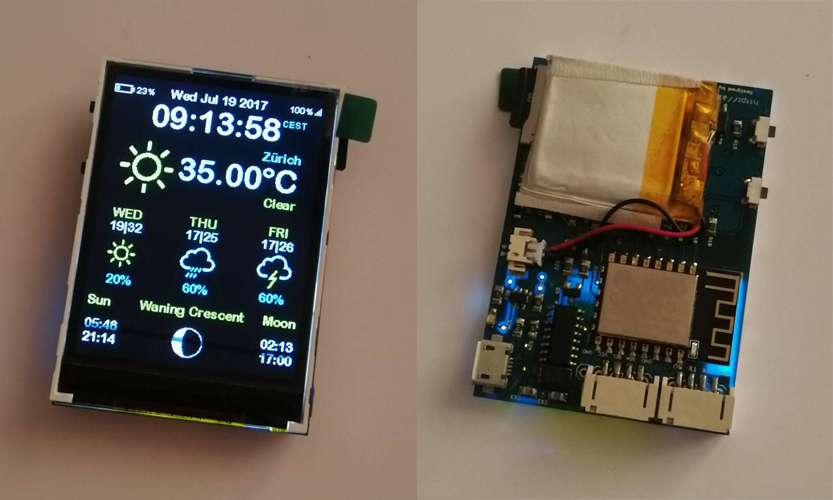

# esp8266-weather-station-color

ESP8266 Weather Station in Color using ILI9341 TFT 240x320 display

## Hardware Requirements

This code is made for an 240x320 65K ILI9341 display with code running on an ESP8266.

[]

## Software Requirements/ Libraries
 * Mini Grafx by Daniel Eichhorn
 * ESP8266 WeatherStation by Daniel Eichhorn
 * Json Streaming Parser by Daniel Eichhorn
 * simpleDSTadjust by neptune2

You also need to get an API key for the Wunderground data: https://www.wunderground.com/

## Settings
Please have a good look at the settings.h file. There you can:
 * set your location for the weather information
 * Set the clock mode: 12hour (am/pm) or 24hour mode
 * Metric system for temperature
 * Timezone and daytime saving options
 * API key for the wunderground service
