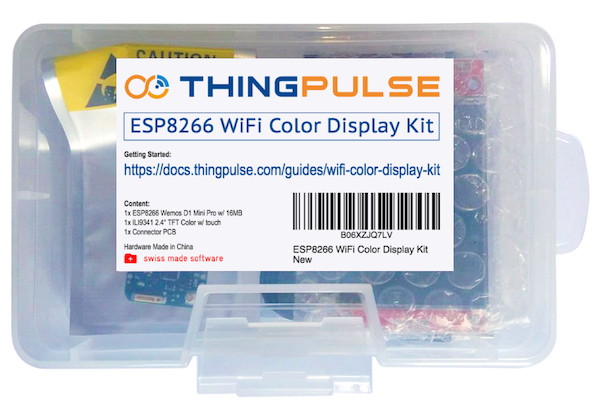

# ThingPulse ESP8266 Weather Station Color

ESP8266 Weather Station Color using ILI9341 240x320 TFT display

## Hardware Requirements

The code in this project supports an ILI9341 240x320 TFT display with code running on an ESP8266. To get you up and running in no time we created a kit which contains all the necessary parts including a custom PCB to connect display and WiFi chip:
[https://thingpulse.com/product/esp8266-wifi-color-display-kit-2-4/](https://thingpulse.com/product/esp8266-wifi-color-display-kit-2-4/)

Buy the kit from us to support future development of this application. Thank you!

## Service level promise

<table><tr><td>
</td><td>This is a ThingPulse <em>prime</em> project. See our <a href="https://thingpulse.com/about/open-source-commitment/">open-source commitment declaration</a> for what this means.</td></tr></table>

## Step-by-step tutorial

A complete step-by-step tutorial/guide is available at [https://docs.thingpulse.com/guides/wifi-color-display-kit/](https://docs.thingpulse.com/guides/wifi-color-display-kit/).

## Licensing, contributions and maintenance

The code in this repository is licensed under [MIT](https://en.wikipedia.org/wiki/MIT_License), a short and simple permissive license with conditions only requiring preservation of copyright and license notices. Thus, you're free to fork the project and use the code for your own projects as long as you keep the copyright notices in place.

ThingPulse is committed to open-source development and will continue to maintain this code. We welcome contributions from the community given they are roughly in line with our [guidelines](CONTRIBUTING.md). However, please understand that we primarily developed this application to be run on our own hardware kit mentioned above. It's the only platform we regularly test the code against. You are of course free to run the code on any hardware you think is compatible but you have to rely on community support should you run into problems. 

ThingPulse runs a support forum for its customers that is better suited to answering user questions than the issues list here.

## Wiring

The [wiring diagram](https://docs.thingpulse.com/specs/wifi-color-display-kit/#wiring) is only needed when you do _not_ buy the self-contained kit from ThingPulse but rather assemble the components yourself. The kit provides a custom PCB that solidly connects microcontroller and display.
