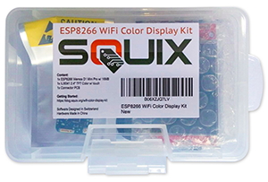
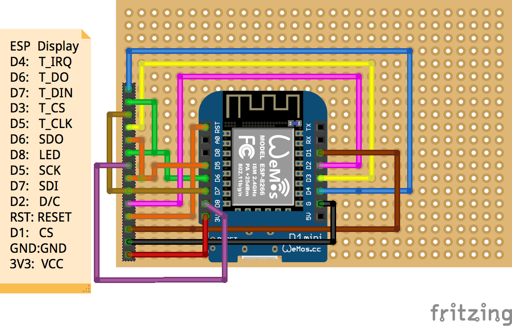

# ThingPulse ESP8266 Weather Station Color

ESP8266 Weather Station Color using ILI9341 240x320 TFT display

## Hardware Requirements

The code in this project supports an ILI9341 240x320 TFT display with code running on an ESP8266. To get you up and running in no time we created a kit which contains all the necessary parts including a custom PCB to connect display and WiFi chip:
[https://thingpulse.com/product/esp8266-wifi-color-display-kit-2-4/](https://thingpulse.com/product/esp8266-wifi-color-display-kit-2-4/)

By buying the kit from us you are supporting future development. Thank you!

## Software Requirements/ Libraries
 * Mini Grafx by Daniel Eichhorn
 * ESP8266 WeatherStation by Daniel Eichhorn
 * Json Streaming Parser by Daniel Eichhorn
 * simpleDSTadjust by neptune2

You also need to get a key for the Wunderground API: [https://www.wunderground.com/weather/api/](https://www.wunderground.com/weather/api/)

## Settings
Please have a good look at the [settings.h](./settings.h) file. It offers config options for:
 * Location to obtain weather data for
 * Clock mode: 12hour (am/pm) or 24hour
 * Metric system for temperature
 * Timezone and daytime saving options
 * API key for the Wunderground service

## Wiring

| Wemos D1 Mini | ILI9341      |
| ------------- |:-------------:|
| D4            | T_IRQ         |
| D6            | T_DO          |
| D7            | T_DIN         |
| D3            | T_CS          |
| D5            | T_CLK         |
| D6            | SDO           |
| D8            | LED           |
| D5            | SCK           |
| D7            | SDI           |
| D2            | D/C           |
| RST           | RESET         |
| D1            | CS            |
| GND           | GND           |
| 3V3           | VCC           |
