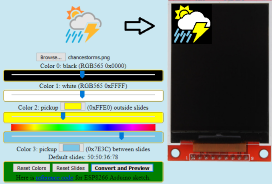

# esp8266-weather-station-color

ESP8266 Weather Station in Color using ILI9341 TFT 240x320 display

----

## Changes by Lorol

* Added a converter tool (click the picture above) to generate C code from own images. 
* Alternative set of icons generated by this converter tool. Compile with weathericons2.h or weathericons.h to see difference.
* A "Screen saver" instead of "Deep sleep" concept after timeout 15 min. See settings.h. Turning ON by touch and hold the lower zone of OLED.
* Added a battery icon for further implementation. Touching the battery icon activates the "Screen saver".
* Force update by touching Wifi icon.
* Fix for [last two wrong icon entries](https://github.com/squix78/esp8266-weather-station-color/issues/39) & added night time icons processing. 
* These changes depend on [esp8266-weather-station](https://github.com/lorol/esp8266-weather-station) modification, too!
* Fix of 00:00:00 clock after forecasts update.
* Multiple WiFi credentials. 

The original README.md follows:

----
## Hardware Requirements

1. SQUIX

This code is made for an 240x320 65K ILI9341 display with code running on an ESP8266.
Since it was sometimes complicated to find the right parts I created a kit which contains all the parts including the connector PCB:
https://blog.squix.org/product/esp8266-wifi-color-display-kit-2-4
By buying the kit from me you are supporting future development. Thank you!

2. AZSMZ TFT

cxandy created a nice adaptation of this code to run with the hardware from AZSMZ:
https://github.com/cxandy/esp8266-weather-station-color

## Software Requirements/ Libraries
 * Mini Grafx by Daniel Eichhorn
 * ESP8266 WeatherStation by Daniel Eichhorn
 * Json Streaming Parser by Daniel Eichhorn
 * simpleDSTadjust by neptune2

You also need to get an API key for the Wunderground data: https://www.wunderground.com/

## Settings
Please have a good look at the settings.h file. There you can:
 * set your location for the weather information
 * Set the clock mode: 12hour (am/pm) or 24hour mode
 * Metric system for temperature
 * Timezone and daytime saving options
 * API key for the wunderground service

## Wiring

| Wemos D1 Mini | ILI9341      |
| ------------- |:-------------:|
| D4            | T_IRQ         |
| D6            | T_DO          |
| D7            | T_DIN         |
| D3            | T_CS          |
| D5            | T_CLK         |
| D6            | SDO           |
| D8            | LED           |
| D5            | SCK           |
| D7            | SDI           |
| D2            | D/C           |
| RST           | RESET         |
| D1            | CS            |
| GND           | GND           |
| 3V3           | VCC           |
