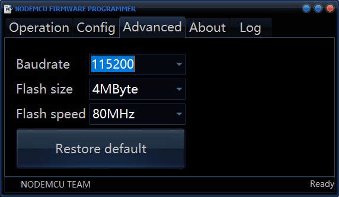
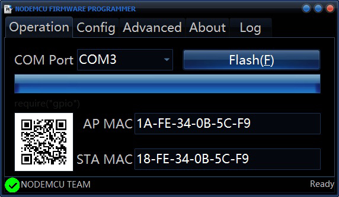

# Flash New Firmware #

  1. ## Download ESP8266Flasher ##

        [ESP8266FLASH.zip](https://github.com/cxandy/esp8266-weather-station-color/tree/master/resources/ESP8266FLASH.zip)

  2. ## Download Firmware  ##

        [Firmware 20180118](https://github.com/cxandy/esp8266-weather-station-color/tree/master/resources/AZSMZ_TFT_20180118.bin)

  3. ## Start flash new Firmware. ##
  
  3.1 connect USB of AZSMZ TFT.
  
  3.2 open esp8266flasher.exe 
  
         
        
  3.3 set "config" please choice your downloaded firmware.    

         
        
  3.4 set "Advanced"    
  
         

  3.5 Start Flash     
    Note:
      1.press "reset" and "flash" button of AZSMZ TFT at the same time.        
      2.release "reset" button first. release "flash" button.        
      3.press "flash" button of ESP8266Flasher.         
  
         
  
  3.5 Reboot
      press "reset" button of AZSMZ TFT.

